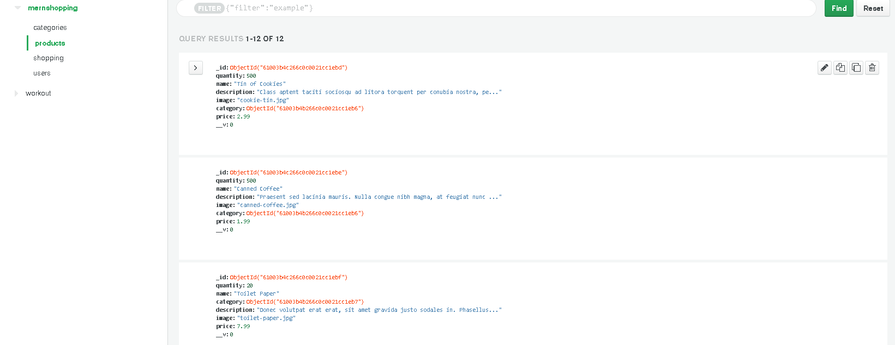
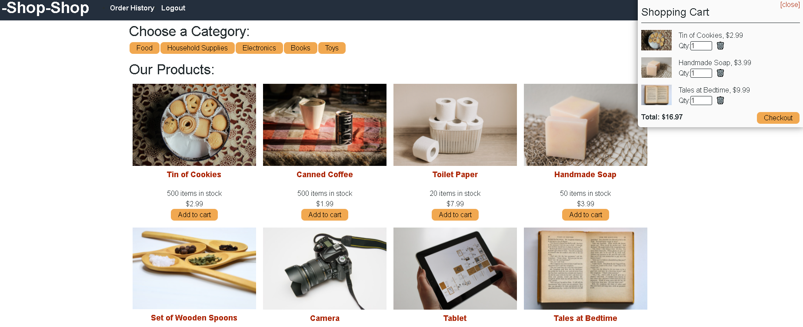
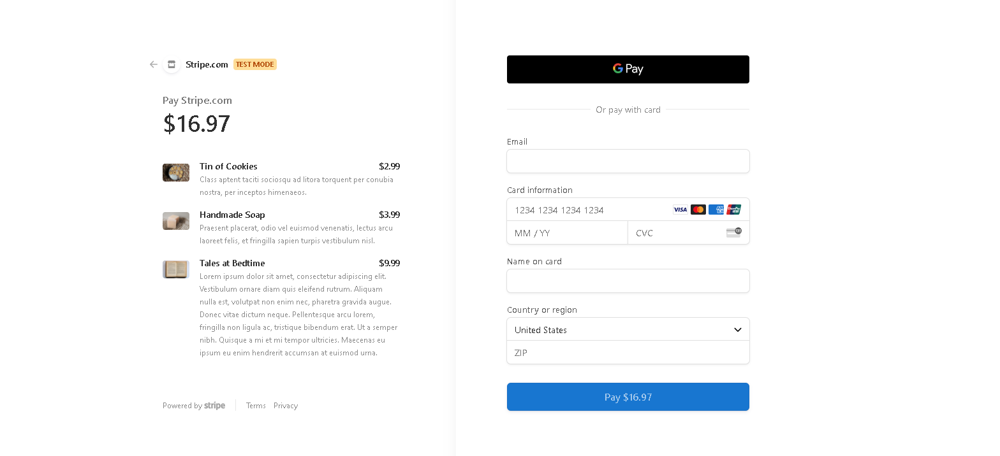

# State-Homework-Redux-Store
Visit the deployed site!
Heroku Deployed Site: https://tranquil-tor-06753.herokuapp.com/

## User Story

AS a senior engineer working on an e-commerce platform
I WANT my platform to use Redux to manage global state instead of the Context API
SO THAT my website's state management is taken out of the React ecosystem

License 
## Table of Contents 
   * [Description](#description)
   * [Installation](#installation)
   * [Usage](#usage)
   * [License](#license)
   * [Demo](#demo)
   * [Database](#database)
   * [Application](#application)
   * [Technologies ](#technologies )
   * [Questions](#questions)

   ## Description 
   Provided with code for application refactor the e-commerce platform from utilizing global state to Redux. This e-commerce site uses React, MongoDb and Strip a platform to make purchases. 

   ## Installation

    npm i
    ## Usage
How to use 
User can  visit the deployed site launched through Heroku to create an account, browsing through the products of the site the user can add items to a cart to later check out.

## License

This Application is covered by  license.
## Demo

## Database
Database

## Application
APP

Stripe-checkout

## Technologies 
- JavaScript 
- Express
- Node.js
- Mongoose
- Heroku
- React
- Redux
- MERN
- Restful-API
- GraphQL
- Apollo

## Questions 
Questions about the applications contact me through:

GitHub Username: https://github.com/https://github.com/Domenicsw92

Email: domenicsw92@gmail.com
